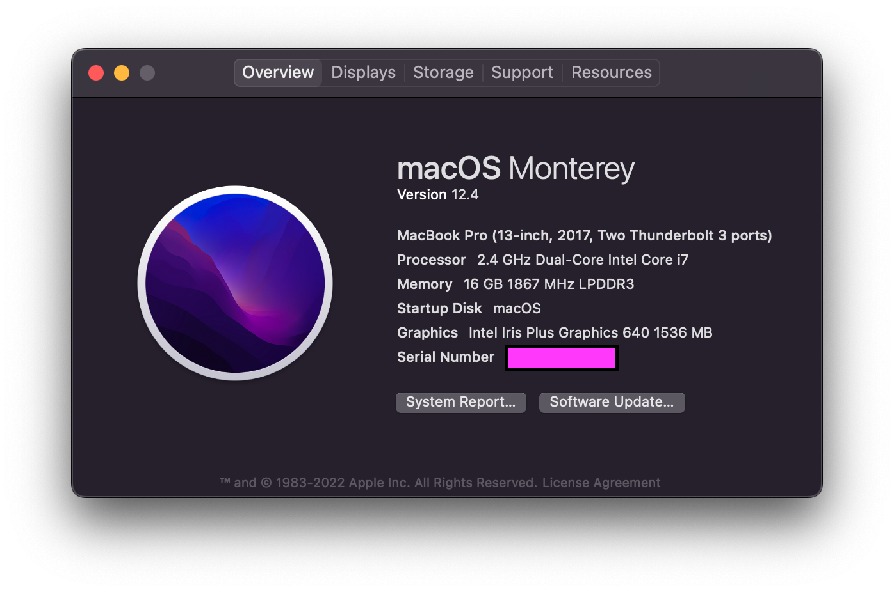
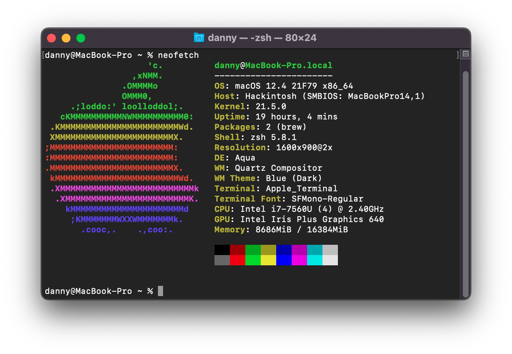

### XPS 13 9360 Hackintosh running macOS Monterey

#

### OpenCore 0.8.2 | macOS Monterey 12.4
#


#

### 📸 About



#

### 💻 Hardware


#

### 📃 Specs

* CPU: Intel Core i7-7560u
* GPU: Intel Iris Plus 640 
* RAM: 16GB DDR3
* Boot Drive: Mushkin Pilot-E 2TB NVME SSD
* OS: macOS macOS Monterey, Windows 11, Ubuntu 20.04
* WIFI/Bluetooth: Replaced stock DW1820A with a DW1560
* Audio/Mic: Realtek ALC256 (had to install ComboJack along with AppleALC for headphones to work)
#

### 👍 Working 
* Power/Battery
* Sleep/wake
* TouchPad
* Keyboard
* Brightness/brightness keys
* Webcam 
* USB 
* HDMI (via usb C)
* Wifi
* Bluetooth
* iMessage
* Facetime
#

### ❌ Not Working:
*  Thunderbolt hotplug 
*  SD card reader (never use it - disabled in BIOS)
#

### ❗️ Usage (How to install)

1. Fill the [SMBIOS](https://dortania.github.io/OpenCore-Install-Guide/config.plist/coffee-lake.html#platforminfo) section according to this guide. 
2. Update BIOS to the latest version
#

### DVMT (❗️Important! Without this step, video won't work and you'll get kernel panic❗️)

Add/Enable DVMT.efi in OpenCore tools. Boot into OpenCore and press spacebar to show tools. Select DVMT.efi. Once booted run the following commands
```
  setup_var 0x4de 0x00  // Disable CFG Lock
  setup_var 0x785 0x06  // Increase DVMT pre-allocated size to 192M For FHD version, it's also recommended setting to 192M
  setup_var 0x786 0x03  // Increase CFG Memory to maximum
```

### 🔔 Updated:
* ~~04/01/2022 OC 0.7.8 macOS 12.2.1~~
* 09/20/2022 OC 0.8.2 macOS 12.4
#

### 🙏 Credits - 
  
 1. A huge thanks to [dortania](https://dortania.github.io/OpenCore-Install-Guide/) for their incredibly detailed guide.
